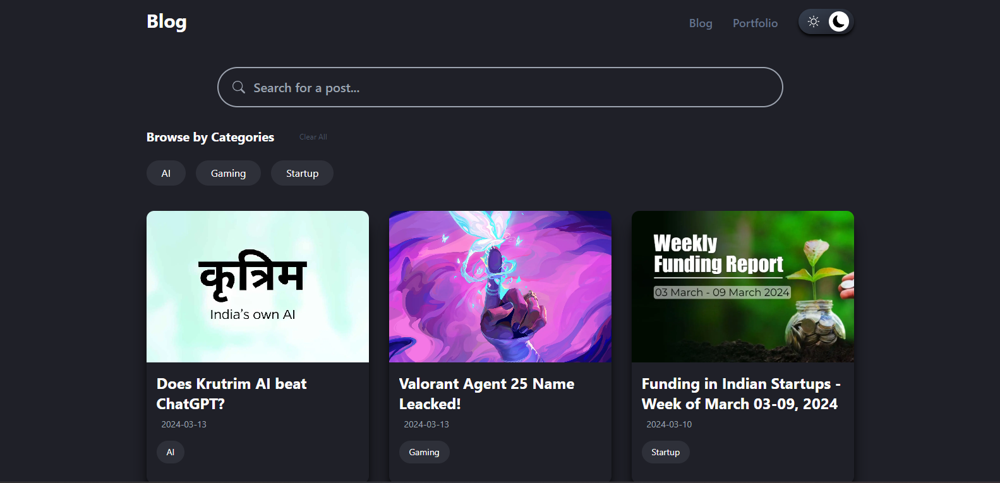
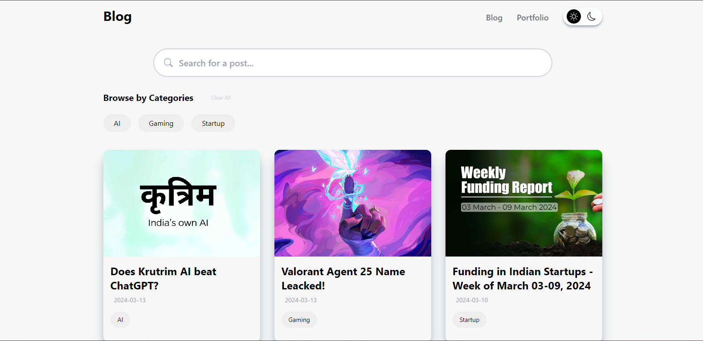
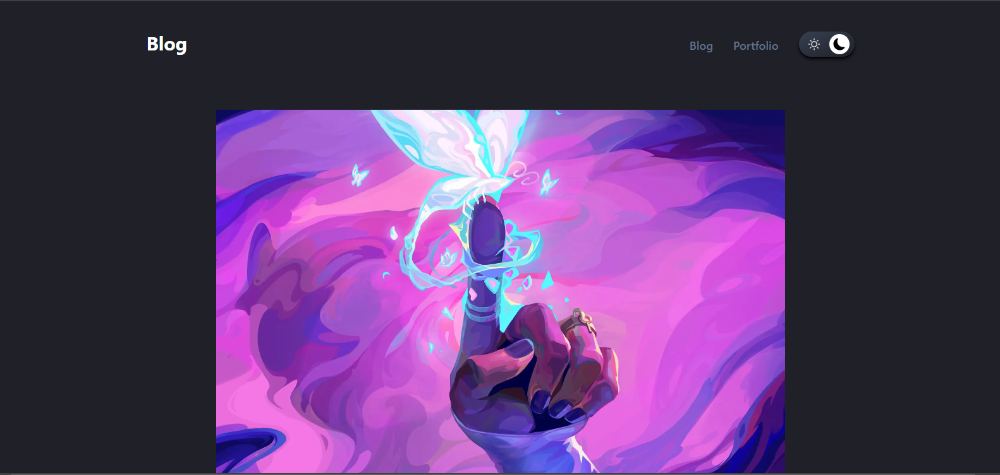
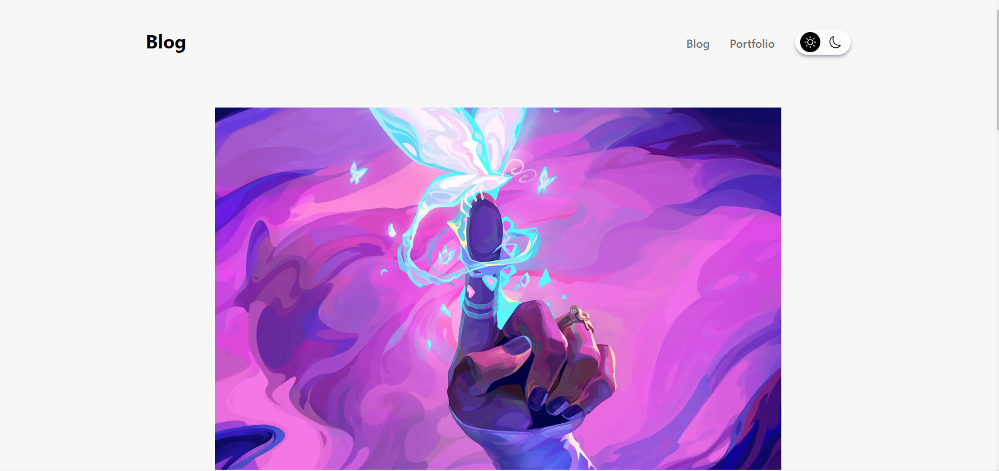
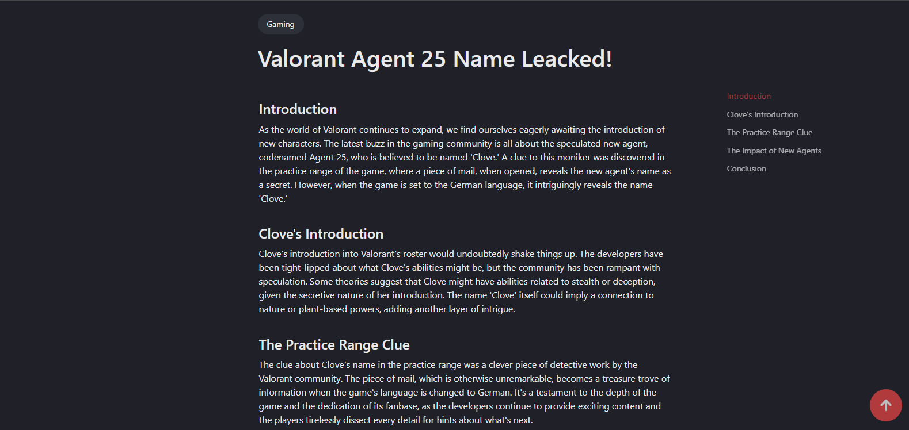
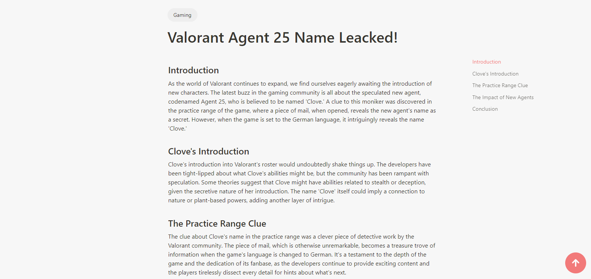
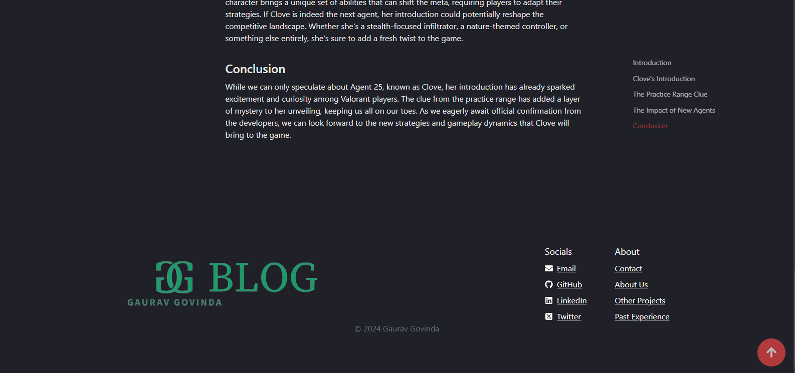
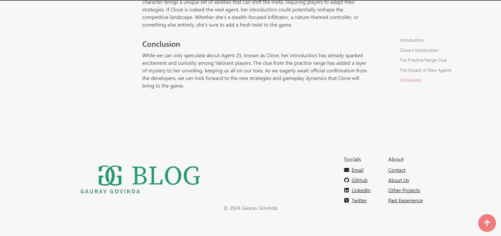
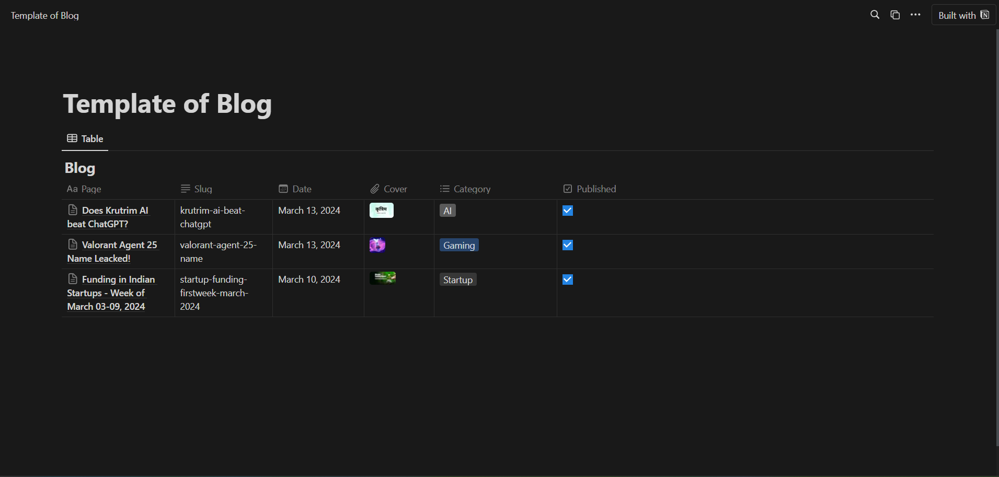
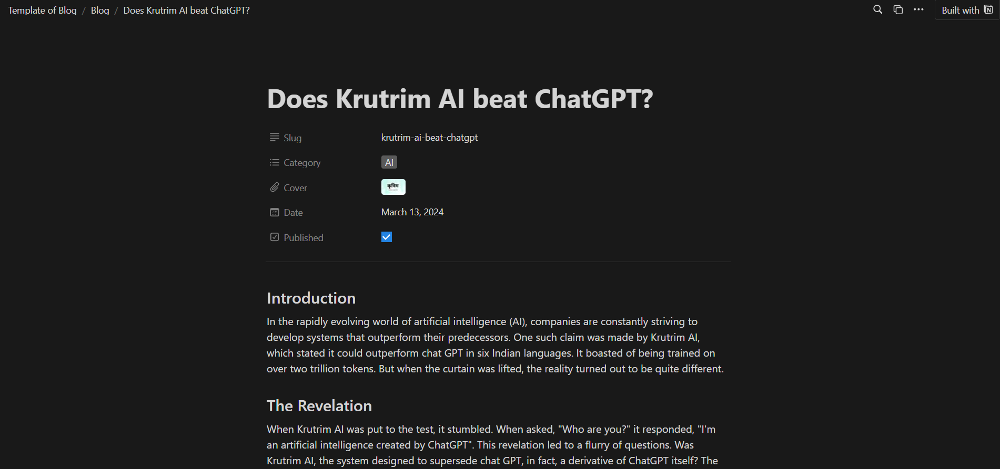

# Blog Website with Notion Integration

## Table of Contents

- [Introduction](#introduction)
- [Deployed Website](#deployed-website)
- [Screenshots](#screenshots)
    - [UI/UX](#uiux)
    - [Notion CMS](#notion-cms)
- [Features](#features)
- [Technologies Used](#technologies-used)
- [Installation](#installation)
    - [Prerequisites](#prerequisites)
    - [Steps](#steps)
- [Contributions](#contributions)
- [License](#license)

## Introduction

This repository hosts a Next.js-based blog website with content management capabilities powered by Notion. Leveraging the Notion API, users can seamlessly create and manage blog content within the Notion platform, which is then dynamically fetched and displayed on the website.

## Deployed Website

The website is deployed and accessible at [https://gauravblog.vercel.app/](https://gauravblog.vercel.app/).

## Screenshots

### UI/UX

| Dark Mode                                                           | Light Mode                                                          |
|---------------------------------------------------------------------|---------------------------------------------------------------------|
|                               |                             |
| **Home:** Landing page of the blog website.                         | **Home:** Landing page of the blog website.                         |
|                           |                         |
| **Post 1:** Example blog post with content.                         | **Post 1:** Example blog post with content.                         |
|                           |                         |
| **Post 2:** Another blog post showcasing different content.         | **Post 2:** Another blog post showcasing different content.         |
|                           |                         |
| **Footer:** Footer section of the blog website.                     | **Footer:** Footer section of the blog website.                     |

### Notion CMS

#### Home


#### Blog


## Features

- **Dynamic Content**: Fetches content dynamically from Notion, enabling real-time updates without redeploying.
- **Browse by Categories:** Users can browse blog posts by categories, enhancing content discoverability.
- **Related Topic Blogs:** Displays related topic blogs at the end of each blog post, encouraging further exploration.
- **Table of Contents:** Provides a table of contents beside every post for easy navigation within the content.
- **Smooth Animations**: Utilizes smooth animations to enhance user experience and engagement.
- **Dark and Light Mode:** Supports both dark and light modes for improved readability and user preference.
- **SEO Optimized**: Implemented SEO best practices to ensure better visibility on search engines.

## Technologies Used

- **Next.js**: React framework for SSR and routing.
- **Tailwind CSS**: Utility-first CSS framework.
- **Notion Client**: Integration with the Notion API.
- **React Notion X**: Renderer for Notion content.
- **Axios**: HTTP client for API requests.
- **React Icons**: Library for customizable icons.
- **Recoil**: State management library.
- **Plaiceholder**: Image placeholder generation.
- **Sharp**: Image processing library.

## Installation

### Prerequisites

Before installing, ensure you have the following installed:

- Node.js (preferably the latest stable version)
- npm package manager (you can use yarn, but this guide assumes you're using npm)

### Steps

1. Clone the repository:

```
git clone https://github.com/Gaurav241/Blog.git
```

2. Navigate to the project directory:

```
cd Blog
```

3. Install dependencies:

```
npm install
```

4. Set up environment variables:

Copy the `.env.example` file to `.env`:

```
cp .env.example .env
```
Then, fill in the environment variables in the `.env` file:

- `NOTION_DATABASE_ID`: Your Notion database ID.
- `NOTION_AUTH_TOKEN`: Your Notion authentication token.
- `API_SECRET`: Choose any secure password for route handler authentication.
- `SITE_URL`: The URL of your website.

#### For Development:

Set `SITE_URL` to `http://localhost:3000` during development.

#### For Production:

Set `SITE_URL` to your production website URL. Ensure it starts with `https://` for secure connections.

5. Setting Up Notion Integration

To integrate your Notion content with this blog website, follow these steps:

I. **Duplicate Notion Blog Template**: Find and duplicate the blog template you want to use in your Notion workspace. [Notion Blog template](https://slash-makemake-be9.notion.site/Template-of-Blog-3bbf99b142f24883950b655bc32d5892)

II. **Retrieve Notion Database ID**: Open the duplicated template, and copy the string of characters from the URL after `Blog-`. This string is your Notion database ID.

III. **Publish Notion Page**: Ensure that the Notion page containing your blog content is published by clicking on the "Share" button and selecting "Publish."

IV. **Obtain Notion Authentication Token**: While logged into Notion, right-click anywhere on the page, select "Inspect," navigate to the "Application" tab, and find the `token_v2` cookie. Copy its value.

6. Start the development server:

```
npm run dev
```
Open http://localhost:3000 in your browser to view the website.

7. Build and run for production:

When you're ready to deploy your portfolio:
```
npm run build
npm run start
```

## Contributions

Contributions are what make the open-source community such an amazing place to learn, inspire, and create. Any contributions you make are greatly appreciated.

## License

This project is licensed under the [MIT License](LICENSE.txt), granting users the freedom to use, modify, and distribute the software for both commercial and non-commercial purposes while retaining the copyright notice and license terms.
